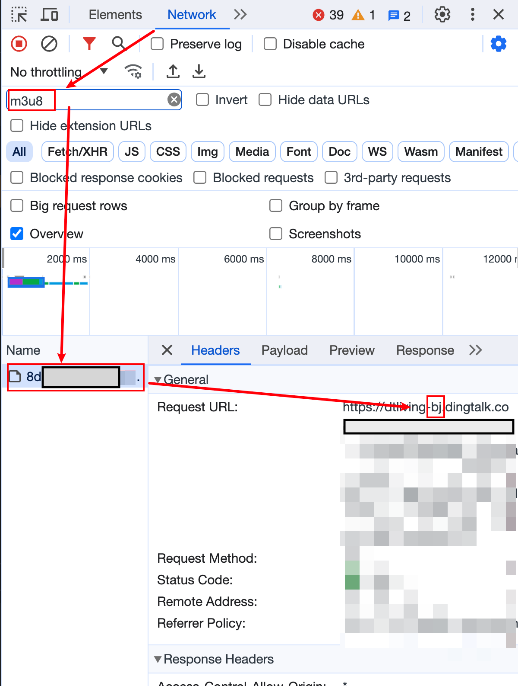
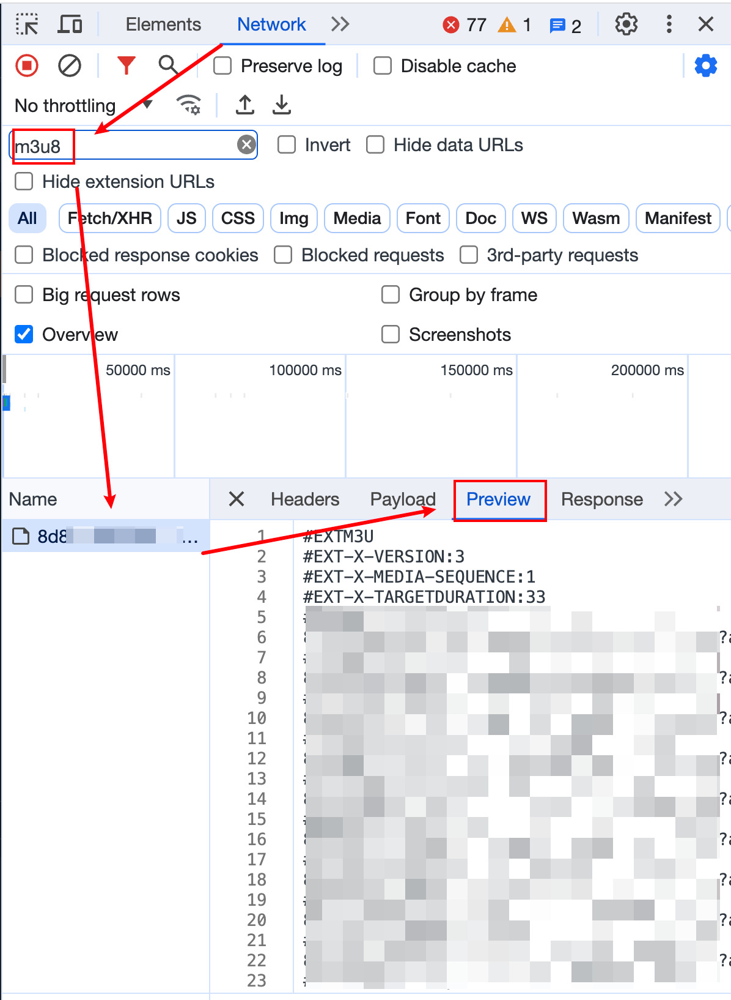

# MacOS 下载钉钉直播回放视频录播的 Python 最新解决方案

## 下载 ffmpeg

官网 https://ffmpeg.org/download.html

并添加到 环境变量 

```shell
ffmpeg -v

ffmpeg version 6.0 Copyright (c) 2000-2023 the FFmpeg developers built with Apple clang version 14.0.3 (clang-1403.0.22.14.1)
```

显示版本号即为成功

## 自动化脚本使用

在浏览器端 , 按 F12 进入界面查看网络请求，过滤 `m3u8` 的信息，查找 Preview 的内容，
点击视频, 找到直播回放, 点开, 向后拖拽一下进度条
如果没有内容，刷新一下，这个请求在视频加载前访问，可能没有记录上

第一步，看一下 `header` 是来自哪里的机房




第二步， Ctrl + A 全选 Preview 的内容 



类似下面这样:

```sh
#EXTM3U
#EXT-X-VERSION:3
#EXT-X-MEDIA-SEQUENCE:1
#EXT-X-TARGETDURATION:35
#EXTINF:33.000,
xxx/1.ts?auth_key=xxx
...
```


保存为 ​​`aa.bj.m3u8` ​​, 在 python 脚本的同级目录下，**注意，中间的 bj，有可能是不一样的** ， sz 表示深圳，bj 表示北京 

然后执行脚本 `python3 a.py` 即可。会创建一个缓存文件夹，支持断点续传，下载完成后自动删除

### 如果是 windows

不能使用参数 `-mac-crf` ，压缩视频，需要更换编码器指令

### python 脚本 [^1]

> 演示版本，和自动化脚本有所不同

```python
import requests, os, re, time


# sz 表示深圳，bj 表示北京，
base_url = "https://dtliving-sz.dingtalk.com/live_hp/"


def get_url():
    url_list = []
    with open("aa.m3u8", "r") as f:
        s = f.readlines()
    for i in s:
        if re.match(r".*?ts.*?", i):
            url_list.append(base_url + i)
    return url_list


def download():
    urls = get_url()
    for i, url in enumerate(urls):
        with open(f"{i + 1}.ts", "wb") as f:
            response = requests.get(url[:-1])  # 去掉换行符
        print(i, "ok")
        # time.sleep(1)


# 整合文件名, 方便FFmpeg合并
def parse_filename():
    base_path = os.getcwd()
    urls = get_url()
    with open("file.txt", "w+") as f:
        for i in range(1, 1 + len(urls)):
            path = f"file '{base_path}/{i}.ts'\n"
            print(path)
            f.write(path)


if __name__ == "__main__":
    download()
    print("download finished...")
    parse_filename()
```

如果成功 会下载 一系列的 `二进制` 文件，`1.ts, 2.ts, 3.ts, ...`

错误的话，则是 `xml` 格式内容的 文件,打开会显示错误信息 。

解决办法，看是不是 `base_url` 没有匹配，sz 和 bj 搞错了

### FFmpeg 合并

```sh
ffmpeg -f concat -safe 0 -i file.txt -c copy a.mp4
```

相信合并完之后觉的文件太大，可以在用 `ffmpeg` 进行再压缩，或者用 `h256/hevc` 重新编码，可以获得更小的体积文件

### 视频体积压缩

#### 最简单的方式，用软件压缩

推荐用 permute 软件压缩

#### 第二种 FFmpeg 将视频转换为 H.265 编码[^2]

使用更高效的视频编码格式是一种常用的方法，可以通过使用压缩率更高的视频编码格式来减小视频文件的体积。下面是一个使用 FFmpeg 将视频转换为 H.265 编码格式的示例：

`ffmpeg -i input.mp4 -c:v libx265 -crf 28 output.mp4`

上述命令将输入视频 input.mp4 转换为 H.265 编码格式，并将结果保存为 output.mp4 文件。其中，-c:v 选项表示视频编码器，libx265 表示使用 x265 编码器，-crf 选项表示视频质量，28 表示目标视频质量，值越小视频质量越高，文件体积越大。

测试，1.3g 的视频 压缩 为 231m 大小，但是速度太慢了 speed=0.8 ，3 小时的视频压缩花了我 4 个小时 ，寻找其他方法

#### mac m1 芯片 启动硬件加速

hevc_videotoolbox 不如 libx265，但速度很快，在我 m1 MacBook air 13 上，

像大多数硬件加速编码器一样，hevc_videtoolbox 的效率不如 libx265。因此，与 libx265 相比，您可能需要给它一个明显更高的比特率才能匹配同等的质量。这可能会破坏从 H.264 重新编码到 HEVC/H.265 的目的。

官网 https://trac.ffmpeg.org/wiki/HWAccelIntro#VideoToolbox

```
# VideoToolbox [¶](https://trac.ffmpeg.org/wiki/HWAccelIntro#VideoToolbox "链接到这一节")

[​VideoToolbox](https://developer.apple.com/documentation/videotoolbox) is the macOS framework for video decoding and encoding.

The following codecs are supported:

- Decoding: H.263, H.264, HEVC, MPEG-1, MPEG-2, MPEG-4 Part 2, ProRes
- Encoding: H.264, HEVC, ProRes

To use H.264/HEVC hardware encoding in macOS, just use the encoder `-c:v h264_videotoolbox` or `-c:v hevc_videotoolbox` for H.264 or HEVC respectively.

Check `ffmpeg -h encoder=...` to see encoder options.

VideoToolbox supports two types of rate control:

- Bitrate-based using `-b:v`
- Constant quality with `-q:v`. Note that the scale is 1-100, with 1 being the lowest and 100 the highest. Constant quality mode is only available for Apple Silicon and from ffmpeg 4.4 and higher.
```

开启 GPU 加速[^3]，并指定视频编码器进行编码。要注意的是 VideoToolbox 不支持 CRF，因此必须通过  `-b:v`  指定码率。

```sh
Codec AVOption crf (Select the quality for constant quality mode) has not been used for any stream. The most likely reason is either wrong type (e.g. a video option with no video streams) or that it is a private option of some encoder which was not actually used for any stream.
```

测试默认选项 大概快了 10 倍

`ffmpeg video -i input.mp4 -c:v hevc_videotoolbox output.mp4`

```sh
frame=126360 fps=114 q=-0.0 Lsize=  413400kB time=02:55:29.95 bitrate= 321.6kbits/s dup=663 drop=0 speed=9.51x
video:315854kB audio:93814kB subtitle:0kB other streams:0kB global headers:0kB muxing overhead: 0.910847%
```

和之前的相比 大概快了 10 倍 ，文件大小从 800m 到 400m ，但是压缩率下降了，我再多测试几个文件

macOS 中 对应 h264 的编码有 libx264 和 h264_videotoolbox ，两个速度差不多，但是 libx264 cpu 占用率高，转码后的文件体积也小，听说播放视频的解码要求也会高一点

### 批处理视频

经过我测试发现，录播文件可是使用 h264 编码，h265 编码在 4k，运动镜头多的情况下优势明显，钉钉直播回放 只有 12 帧 和 1080p 画质，不需要上 h265，而且我学习的录播还是 ppt 居多，很少运动镜头。

推荐以下指令：

`find ./ -name '*.mp4' -exec sh -c 'ffmpeg -i "$0" -c:v libx264 -crf 30 -c:a aac "${0%%.mp4}-hevc.mp4"' {} \;`

### 引用链接

[^1]: 代码部分来源 https://blog.51cto.com/u_15366127/6084937
[^2]: 使用 ffmpeg 缩小视频体积的几种方式 https://juejin.cn/post/7222575963564654648
[^3]: FMPEG 硬件加速 https://blog.xm.mk/posts/1a3h/
